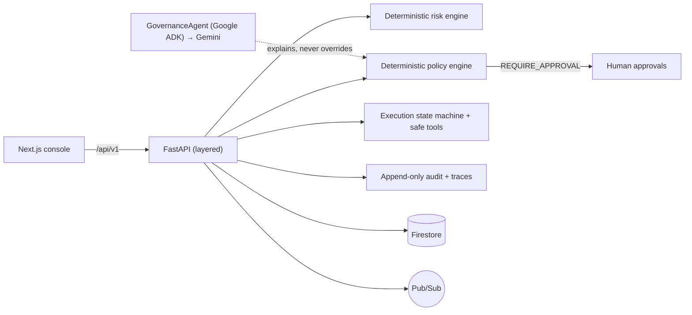

# SwarmOps — Enterprise Agent Control Plane

**Discover. Govern. Orchestrate. Observe.**

SwarmOps sits **above** agent runtimes and control planes and makes an AI workforce safe
to run in a real company: agent discovery, deterministic risk & policy enforcement, human
approvals, dependency/blast-radius analysis, self-evolving governance, an append-only
audit trail, and observability.

- **Hackathon track:** Fortified Enterprise Fleet
- **Built for Google All Things Agentic Hackathon 2026.**
- **Status:** P00–P14 complete · **103 backend tests green** · ruff + mypy clean · web build green

Built with **Gemini** and **Google Cloud**, and designed for the **Gemini Enterprise
Agent Platform** (adapter seams with truthful status on the Integrations page).

> **The core invariant: governance is deterministic. No LLM sits in the authorization
> path.** The GovernanceAgent (Google **ADK**, with Gemini via the GenAI SDK / Vertex AI)
> explains risk and recommends remediation — it can never override a DENY or QUARANTINE.
> This is enforced in code and proven by tests that feed a hostile explainer and assert
> the decision stands.

## The problem

Autonomous agents are entering the enterprise faster than governance can adapt. Companies
wire up agents that can deploy code, move money, and touch customer data — with none of
the controls they demand of human employees. It's impressive right up until an agent does
something irreversible because the *model* decided to.

## Why agent sprawl matters

A single team spins up dozens of agents across tools, MCPs, databases, and external APIs.
Nobody owns the fleet. There's no risk profile, no policy, no kill switch, no audit. One
over-privileged agent with a path to PII and a payment API is a breach waiting to happen.

## The solution

SwarmOps manages an AI workforce with the same rigor used for people: clear authority,
human approval on high-risk actions, a complete audit trail, and safe, reversible change
over time. Every autonomous agent gets an **owner, identity, policy, risk profile, trace,
and kill switch.**

## What it does (the full governed arc)

Discover the rogue **CustomerRefundAgent** → it auto-assesses to **87/100 CRITICAL** →
policy **quarantines** it → a privileged operator **reactivates** it under governance →
a **$650 refund** runs through the state machine → **pauses for two-stage human
approval** → **resumes and executes exactly once** — with an append-only, trace-correlated
audit throughout. Plus: a React Flow **dependency graph + blast radius**, a **security
scanner** that blocks prompt injection / PII export, and **self-evolving governance** that
rejects a candidate agent version whose compliance regresses.

## Architecture

| Layer | Folder | Tech | Hosting |
|-------|--------|------|---------|
| Console | `apps/web` | Next.js 14 (App Router, Tailwind, shadcn-style, React Flow) | Cloud Run |
| Backend | `apps/api` | FastAPI, layered `api / application / domain / infrastructure` | Cloud Run |
| Persistence | — | SQLite (local) / **Firestore** (cloud) behind one interface | Cloud SQL-free |
| Eventing | — | In-memory (local) / **Pub/Sub** (cloud) | — |
| AI | `apps/api/app/agents` | **GovernanceAgent** on Google **ADK** (Gemini via GenAI SDK / **Vertex AI**) | — |

See [`docs/architecture/system.md`](docs/architecture/system.md) (component + governance
diagrams), [`docs/architecture/execution-sequence.md`](docs/architecture/execution-sequence.md)
(the governed refund sequence), and the ADRs in [`docs/adr/`](docs/adr/).



## Google technologies used

- **Google ADK** — the GovernanceAgent is a real ADK `LlmAgent` exposing the constrained
  governance tools (with a Google **GenAI SDK** fallback; either is a Google Agent Framework).
- **Gemini** — the GovernanceAgent's explanation layer; **Vertex AI** routing when configured.
- **Cloud Run** — API + web, scale-to-zero.
- **Firestore** — cloud persistence behind the repository interfaces (`PERSISTENCE_BACKEND=firestore`).
- **Pub/Sub** — domain event bus (`EVENT_BUS=pubsub`).
- **Cloud Trace** — OpenTelemetry export of execution traces (`OTEL_ENABLED=true`).
- **Model Armor** — inline security guardrails adapter (reuses the security scanner).
- **Secret Manager, Artifact Registry, IAM** — provisioned by Terraform.
- **Agent Registry / Runtime / Memory Bank / Gateway** — adapter seams (P13) with truthful
  CONNECTED / DEMO_MODE / NOT_CONFIGURED status on the Integrations page.

## Demo scenario

Open the **Guided Demo** page (`/demo`) and run the 8 steps — each calls real backend
logic. Full narration: [`docs/demo/4-minute-demo.md`](docs/demo/4-minute-demo.md).

## Repository structure

```
swarmops-agentic/
├── apps/
│   ├── web/            Next.js console
│   └── api/            FastAPI backend (api/application/domain/infrastructure)
├── agents/            Google agent-framework agents (GovernanceAgent lives in apps/api/app/agents)
├── packages/          Shared contracts/utilities
├── infrastructure/    Terraform + deploy.sh (Cloud Run, Firestore, Pub/Sub, IAM, Secret Manager)
├── docs/              architecture, adr, security, deployment, demo, integrations
├── docker-compose.yml, Makefile, .env.example
```

## Prerequisites

- Python **3.11+** (developed on 3.13), Node **20+** (developed on 22) and npm
- Optional: Docker + Docker Compose; `gcloud` for cloud deploy

## Local development

```bash
cp .env.example .env
make install          # API venv + web deps
make dev              # API :8080 + Web :3000
```

Open **http://localhost:3000** → it redirects to the fleet Overview; start with the
**Guided Demo** in the sidebar. Verify the backend:

```bash
curl http://localhost:8080/health
curl http://localhost:8080/api/v1/status
```

With Docker: `make up` (web :3000, api :8080).

## Cloud deployment

Full walkthrough: [`docs/deployment/google-cloud.md`](docs/deployment/google-cloud.md).

```bash
# gcloud one-shot (build + push + deploy, scale-to-zero)
PROJECT_ID=my-project REGION=us-central1 ./infrastructure/deploy.sh
# or Terraform
cd infrastructure/terraform && terraform init && terraform apply -var project_id=$PROJECT_ID ...
```

## Environment variables

| Variable | Purpose |
|----------|---------|
| `ENVIRONMENT`, `DEMO_MODE` | runtime + demo seeding |
| `PERSISTENCE_BACKEND` | `local` (SQLite) or `firestore` |
| `EVENT_BUS` | `inmemory` or `pubsub` |
| `GOOGLE_CLOUD_PROJECT`, `GOOGLE_CLOUD_LOCATION` | GCP project / region |
| `GOOGLE_GENAI_USE_VERTEXAI`, `GEMINI_API_KEY`, `GEMINI_MODEL` | Gemini config |
| `OTEL_ENABLED` | export traces to Cloud Trace |
| `MODEL_ARMOR_ENABLED` | use Google Model Armor |
| `NEXT_PUBLIC_API_URL` | backend base URL (web) |

No secrets are committed; `.env` is gitignored and cloud secrets live in Secret Manager.

> The demo Cloud Run deployment uses public ingress for judge accessibility. Production
> deployments require authenticated ingress and role-based access (see the deployment doc).

## Testing

```bash
make test    # 103 backend tests (pytest)
make lint    # ruff + mypy (backend), eslint + tsc (frontend)
```

Highlights: deterministic risk boundaries, policy engine (no `eval`), state machine +
idempotency, two-stage approval, discovery→quarantine, GovernanceAgent no-override,
graph/blast-radius, audit/observability, security scanner, self-evolving governance,
event bus, integration status, and a full **end-to-end demo-flow** test.

## Security model

Deterministic authority + human-in-the-loop + append-only audit. Full threat model:
[`docs/security/threat-model.md`](docs/security/threat-model.md). Highlights: no LLM in
the authorization path; constrained agent tools; idempotent financial actions; role
authority enforced by the backend; quarantine kill switch; secrets in Secret Manager.

## Known limitations

- Live Google integrations (Registry/Runtime/Memory/Gateway, Model Armor, live Gemini)
  are adapter **seams** with truthful status — bound to real services when configured.
- The security scanner is a demo pattern set, not production DLP.
- Firestore/Pub/Sub/Cloud Trace live paths are exercised via config + the `[gcp]`/`[otel]`
  extras (tested locally against the Firestore emulator).

## Future roadmap

- Bind the adapter seams to live Google Agent Registry / Runtime / Memory Bank / Gateway.
- Multi-turn ADK tool-calling for the GovernanceAgent (keeping the no-override guarantee).
- Console authentication + per-tenant isolation; retention/archival for the audit trail.
- Live evaluators that derive performance/compliance from execution history.

## Submission disclosure

- **Newly built during the submission period** (August 2026) for the Google All Things
  Agentic Hackathon; every commit in this repository falls within that window.
- **No pre-existing code was incorporated.** SwarmOps is an original work; it shares only
  a name/concept with an unrelated earlier private project — no code was carried over.
- Built with standard frameworks/libraries (FastAPI, Next.js, React Flow, google-adk,
  google-genai, …) and **AI coding assistants**, as permitted by the Official Rules. All
  such dependencies are used under their open-source licenses.
- Licensed under the MIT License (see [`LICENSE`](LICENSE)).

---

Built for **Google All Things Agentic Hackathon 2026**.
