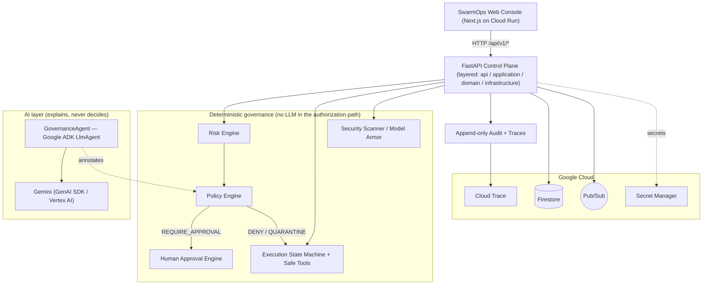
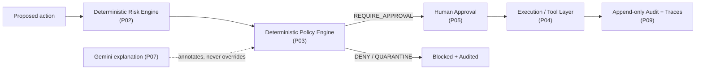

# SwarmOps — System Architecture

_Enterprise Agent Control Plane · Discover. Govern. Orchestrate. Observe._

## Overview

SwarmOps sits **above** agent runtimes and control planes. It does not replace the
LLM, the agent framework, or the runtime — it is the management layer that makes an
AI workforce safe to run: identity, risk, policy, approvals, audit, and observability.

The system is a monorepo with a Next.js operational console and a layered FastAPI
backend. Authorization is **deterministic**; the GovernanceAgent (Google **ADK** with
Gemini via the GenAI SDK / Vertex AI) provides explanation and analysis only — never
enforcement.

## Component diagram (final, P00–P14)

## Layering rules

- **api** — HTTP only. Validates input, calls the application layer, shapes responses.
  No business logic.
- **application** — orchestrates use-cases (risk assessment, policy evaluation,
  approvals, discovery lifecycle). Depends on domain + infrastructure interfaces.
- **domain** — pure models and deterministic rules. No framework or I/O imports.
- **infrastructure** — concrete adapters (SQLite/Firestore repositories, in-memory/
  Pub/Sub event bus, Gemini/ADK, Model Armor, telemetry). Implements interfaces declared
  by the domain/application.

The dependency arrow always points **inward** toward the domain.

## Governance principle

Gemini's output can **annotate** a decision but can never flip a DENY or QUARANTINE.
That invariant is enforced in code and tested from P07 onward.
